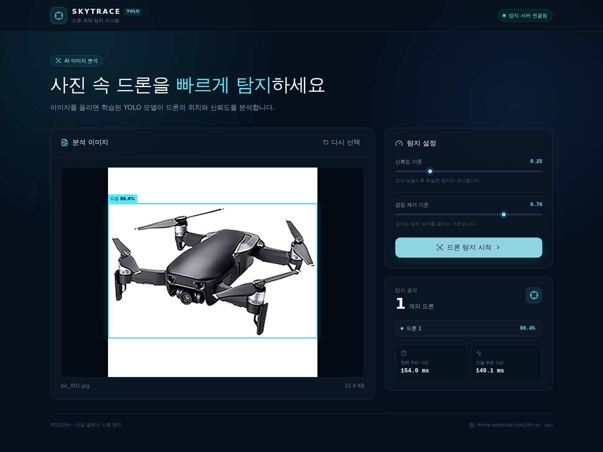
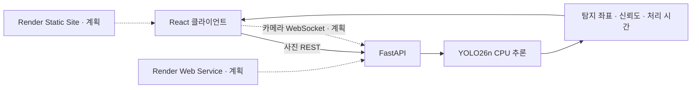

# SKYTRACE — YOLO 드론 탐지 웹 애플리케이션

사진에서 드론의 위치를 찾고 신뢰도와 처리 시간을 보여주는 웹 애플리케이션입니다. 두 개의 공개 데이터셋을 중복 제거 후 통합하여 YOLO26n을 학습했고, React 클라이언트와 FastAPI 추론 API로 실제 서비스 흐름을 구현했습니다.

> 현재 사진 탐지 기능까지 동작합니다. 모바일 실시간 카메라 탐지, ONNX 경량화와 Render 배포는 다음 개발 단계입니다.



## 주요 결과

| 항목 | 결과 |
| --- | ---: |
| 고유 이미지 | 11,485장 |
| 바운딩 박스 | 11,828개 |
| 배경 이미지 | 929장 |
| 학습 / 검증 / 테스트 | 7,994 / 1,625 / 1,866장 |
| Precision | 0.977 |
| Recall | 0.959 |
| mAP50 | 0.971 |
| mAP50-95 | 0.614 |
| CPU 추론 시간 | 이미지당 16.0ms |

성능은 모델 선택에 사용하지 않은 통합 테스트 1,866장에서 측정했습니다. CPU 시간은 로컬 테스트 환경의 모델 추론 기준이며 네트워크와 이미지 해석 시간은 포함하지 않습니다.

## 구현 상태

### 완료

- 두 Kaggle 데이터셋의 클래스 통합과 SHA-256 중복 제거
- 학습·검증·테스트 누수 방지와 출처별 독립 평가
- YOLO26n 50 epoch 파인튜닝 및 CPU 재평가
- JPEG, PNG, WebP, BMP 이미지 탐지 REST API
- 파일 크기·이미지 크기·형식 검증과 명시적인 오류 응답
- 드래그 앤 드롭, 미리보기와 이미지 위 탐지 상자
- 신뢰도·겹침 제거 기준 조절과 처리 시간 표시
- 모바일·태블릿·데스크톱 반응형 화면
- FastAPI 스모크 테스트와 Playwright 업로드 검사

### 다음 단계

- 사진 탐지와 실시간 카메라 화면 분리
- 모바일 후면 카메라 권한과 전면·후면 전환
- WebSocket 기반 적응형 프레임 전송과 실시간 탐지 상자
- ONNX Runtime 변환 후 정확도·속도·메모리 비교
- 결과 차트와 탐지 이미지 다운로드
- Render Static Site와 Web Service 배포
- GitHub Actions 자동 검사

## 서비스 구조



사진 요청은 `multipart/form-data`로 전달됩니다. 계획된 카메라 모드는 브라우저가 프레임을 640픽셀 입력으로 축소하고, 이전 결과를 받은 뒤 다음 프레임을 보내 요청이 쌓이지 않게 설계합니다. 카메라 프레임은 저장하지 않습니다.

## 데이터셋과 정제

- [YOLO Drone Detection Dataset](https://www.kaggle.com/datasets/muki2003/yolo-drone-detection-dataset)
- [Drones Dataset YOLO](https://www.kaggle.com/datasets/monkeyboy999/drones-dataset-yolo)

두 데이터셋의 탐지 클래스를 `0: drone`으로 통일했습니다. 파일 내용을 SHA-256으로 비교하여 첫 번째 데이터셋에서 중복 20장, 두 번째 데이터셋에서 중복 12장을 제외했습니다. 분할 사이의 중복은 학습 쪽 사본을 제거하고 평가 이미지를 보존했습니다. 두 출처 사이에 내용이 같은 이미지는 없었습니다.

| 분할 | 이미지 | 박스 | 배경 이미지 |
| --- | ---: | ---: | ---: |
| 학습 | 7,994 | 8,255 | 650 |
| 검증 | 1,625 | 1,664 | 140 |
| 테스트 | 1,866 | 1,909 | 139 |

상세 분할 정책은 [`datasets/combined-drone/README.md`](datasets/combined-drone/README.md), 학습 과정과 실행 결과는 [`drone_yolo_training.ipynb`](drone_yolo_training.ipynb)에 기록되어 있습니다.

## 기술 구성

| 영역 | 기술 |
| --- | --- |
| 모델 | Ultralytics YOLO26n, PyTorch |
| 서버 | Python 3.12, FastAPI, Uvicorn, Gunicorn |
| 클라이언트 | TypeScript, React, Vite, Tailwind CSS |
| 검사 | Pytest 스타일 스모크 검사, Playwright |
| 배포 목표 | Render Static Site, Render Web Service, Docker |

## 로컬 실행

### 1. 추론 서버

Python 3.12와 `uv`가 필요합니다.

```bash
cd codes/server
uv venv --python 3.12
uv pip install -r requirements-server.txt
uv run --no-sync uvicorn app.main:app --host 0.0.0.0 --port 8001
```

서버가 시작되면 다음 주소를 확인할 수 있습니다.

- 상태 확인: <http://localhost:8001/health>
- API 문서: <http://localhost:8001/docs>

### 2. 웹 클라이언트

새 터미널에서 실행합니다.

```bash
cd codes/client
npm ci
npm run dev -- --host 0.0.0.0 --port 5173
```

브라우저에서 <http://localhost:5173>으로 접속합니다. 클라이언트는 기본적으로 `http://localhost:8001` API를 사용합니다. 다른 주소를 사용할 때는 `VITE_API_BASE_URL` 환경 변수를 설정합니다.

## API

| 방식 | 경로 | 설명 |
| --- | --- | --- |
| `GET` | `/health` | 모델, 체크섬, 실행 장치와 클래스 확인 |
| `POST` | `/api/v1/detect` | 이미지 한 장에서 드론 탐지 |
| `WebSocket` | `/api/v1/stream` | 카메라 프레임 탐지, 구현 예정 |

```bash
curl -X POST "http://localhost:8001/api/v1/detect?confidence=0.25&iou=0.7" \
  -F "file=@codes/client/tests/fixtures/pic_001.jpg"
```

응답에는 픽셀 좌표와 정규화 좌표, 클래스, 신뢰도, 탐지 개수, 이미지 정보와 처리 시간이 포함됩니다.

## 검사

```bash
cd codes/client
npm run typecheck
npm run build
npm run test:e2e
```

```bash
cd codes/server
.venv/bin/python scripts/smoke_test.py
```

Playwright 검사는 실제 테스트 이미지를 API에 전송하여 탐지 결과와 모바일·태블릿 레이아웃을 확인합니다.

## 프로젝트 구조

```text
.
├── codes/
│   ├── client/                  # React 웹 클라이언트
│   └── server/                  # FastAPI 추론 서버와 서비스 가중치
├── datasets/combined-drone/     # 통합 분할 정의와 메타데이터
├── drone_yolo_training.ipynb   # 실행된 학습·평가 기록
├── raw.md                       # 제품 및 구현 요구사항
└── README.md
```

원본 이미지, 라벨, 가상 환경과 학습 실행 폴더는 저장소 용량을 줄이기 위해 Git에서 제외합니다. 데이터는 위 Kaggle 출처에서 내려받을 수 있으며 서비스 가중치의 SHA-256은 다음과 같습니다.

```text
9b0f104ef16662d471f99e3a394f8ff20bcac5ea80a8f7af0380b64bd3073702
```

## 설계상 한계

- 작은 드론, 흐림, 야간, 역광과 복잡한 배경에서 성능이 낮아질 수 있습니다.
- 학습 데이터의 촬영 환경과 다른 도메인에서는 별도의 검증이 필요합니다.
- 현재 API는 CPU 요청을 직렬 처리하므로 동시 사용자가 많아지면 지연이 증가합니다.
- Render 무료 서버는 유휴 종료와 제한된 CPU·메모리 때문에 실시간 카메라 데모의 분석률이 낮을 수 있습니다.
- 이 탐지 결과를 안전이나 보안 판단의 유일한 근거로 사용해서는 안 됩니다.
